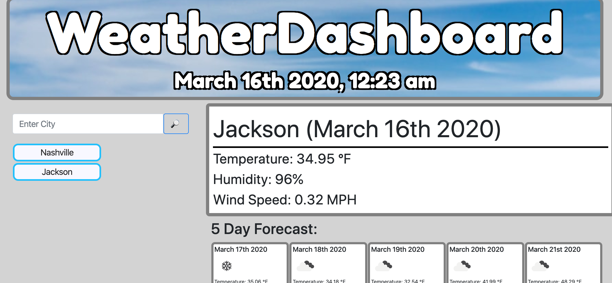

# WeatherDashboard
https://timothymickiewicz.github.io/WeatherDashboard/
## View

## Table of Contents
* [Description](#description)
* [Installation](#installation)
* [Use](#use)
* [Licensing](#licensing)
* [Contributors](#contributors)
* [Contributing](#contributing)
* [Tests](#tests)
* [Github](#github)
 
## Description
This is an application to show the user the current weather of a city of thier choice, as well as a 5 day forecast
 
## Installation
Clone from this repository, or just use the live-link to use the application.
 
## Use
This application is intended to provide the user with current weather conditions and a 5 day forecast of any city that they enter. Previously searched cities are added to a list to be revisited at a later date. Weather conditions shown include: temperature in fahrenheit, wind speed, uv index, and an icon representing current weather status.
 
## Licensing

 
## Contributors
Timothy Mickiewicz
 
## Contributing
 
Please note that this project is released with a Contributor Code of Conduct. By participating in this project you agree to abide by its terms. 
https://www.contributor-covenant.org/version/2/0/code_of_conduct/
 
## Tests
To run tests, enter `npm run test` in the terminal
 
## Github
 
timothy.mickiewicz@gmail.com
